# 📘 Lab 09c - Implement Azure Container Apps


## Indice

- [Descripción del laboratorio](#descripción-del-laboratorio)
- [Escenario del laboratorio](#escenario-del-laboratorio)
- [Esquema Visual del Laboratorio](#esquema-visual-del-laboratorio)
- [Habilidades adquiridas](#habilidades-adquiridas)
- [Costo Total del Laboratorio](#costo-total-del-laboratorio)
- [Desarrollo del laboratorio](#desarrollo-del-laboratorio)
  - [Tarea 1: Create and configure an Azure Container App and Environment](#tarea-1-create-and-configure-an-azure-container-app-and-environment)
  - [Tarea 2: Test and vierify deployment of the Azure Container App](#tarea-2-test-and-verify-deployment-of-the-azure-container-app)
- [Conceptos reforzados](#conceptos-reforzados)
- [Resultados esperados](#resultados-esperados)
- [Limpieza de recursos](#limpieza-de-recursos)
- [Contribuciones](#contribuciones)
- [Licencia](#licencia)

---

## Descripción del laboratorio

En este laboratorio trabajamos con **Azure Container Apps (ACA)**, un servicio administrado que nos permite ejecutar aplicaciones en contenedores sin necesidad de configurar ni mantener un clúster de Kubernetes. La propuesta de ACA es simplificar la experiencia de despliegue y operación de aplicaciones modernas, ofreciendo características como escalado automático, balanceo de tráfico, integración con observabilidad y soporte para microservicios.

El objetivo principal es que comprendamos cómo crear un entorno de contenedores en Azure, desplegar una aplicación de prueba y verificar su funcionamiento. A diferencia de otros servicios como AKS, aquí no necesitamos preocuparnos por la administración del clúster, lo que reduce la complejidad y acelera la adopción de soluciones en la nube. Este laboratorio está diseñado para ser breve (aproximadamente 15 minutos), pero nos introduce a conceptos clave de la administración de aplicaciones en contenedores dentro de Azure.

---

## Escenario del laboratorio

La organización cuenta actualmente con una aplicación web que se ejecuta en una máquina virtual dentro de su centro de datos local. El plan estratégico es migrar todas las aplicaciones hacia la nube para reducir la dependencia de infraestructura física y minimizar la carga de administrar múltiples servidores. En este contexto, se decide evaluar **Azure Container Apps** como una opción viable.

El escenario refleja una transición hacia un modelo más ágil y escalable: en lugar de mantener servidores dedicados, se aprovecha un servicio administrado que permite desplegar aplicaciones en contenedores con mayor facilidad. Con ACA, la organización puede enfocarse en el desarrollo y la funcionalidad de la aplicación, mientras Azure se encarga de la infraestructura subyacente. Este laboratorio nos sitúa en el rol de administradores que deben crear el entorno, desplegar la aplicación y comprobar que está disponible públicamente, simulando un caso real de migración hacia la nube.

---

## Esquema Visual del Laboratorio

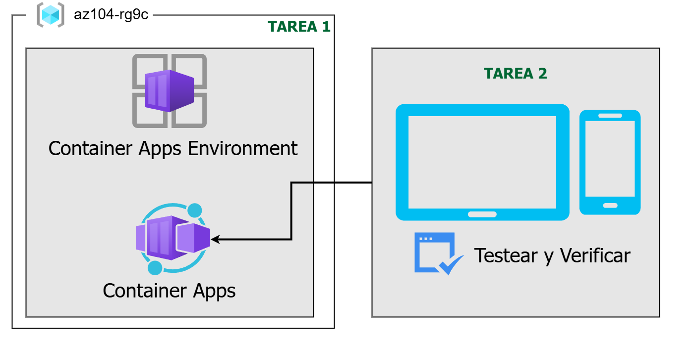

>El esquema refleja la migración de una aplicación desde un entorno local hacia un contenedor administrado en Azure

---

## Habilidades adquiridas

- Creación y configuración de un **Azure Container App** y su entorno.
- Comprensión de la diferencia entre ACA y AKS (Azure Kubernetes Service).
- Validación de despliegues mediante URL pública y observación de logs.
- Aplicación de buenas prácticas de limpieza de recursos.

---

## Costo Total del Laboratorio

El plan de consumo de ACA se factura por segundo de uso de recursos:

- **vCPU activo:** $0.000024 por segundo.
- **Memoria (GiB-segundos):** $0.000003 por segundo.
- **Idle vCPU:** $0.000003 por segundo.
- Primeros **180,000 vCPU-segundos**, **360,000 GiB-segundos** y **2 millones de requests** al mes son gratuitos.

Ejemplo: un contenedor de 1 vCPU y 2 GiB RAM ejecutado por 15 minutos ≈ **$0.03 USD**.

---

## Desarrollo del laboratorio

### Tarea 1: Create and configure an Azure Container App and environment

Los **Azure Container Apps (ACA)** llevan el concepto de un clúster de Kubernetes administrado un paso más allá, ya que gestionan el entorno del clúster y además proporcionan servicios administrados adicionales sobre él. A diferencia de un clúster de Kubernetes en Azure (AKS), donde aún debemos encargarnos de la administración del clúster, una instancia de ACA elimina parte de la complejidad de configurar y mantener dicho clúster.

1. Desde el **portal de Azure**, buscamos y seleccionamos *Container Apps*.
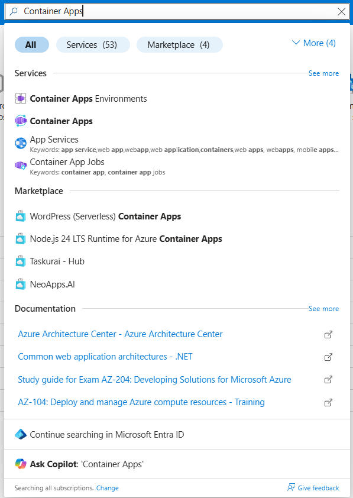

2. Hacemos clic en **+ Crear** y, en el menú desplegable, elegimos **Container App**. (Podemos notar que existen otras opciones).
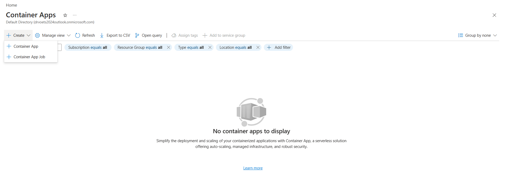

3. En la pestaña **Basics**, completamos los siguientes valores:

   - **Subscription:** seleccionamos nuestra suscripción de Azure.
   - **Resource group:** `az104-rg9`.
   - **Container app name:** `my-app`.
   - **Region:** *East US*.
   - **Container Apps Environment:** seleccionamos *Create new*, asignamos el nombre `my-environment` y luego hacemos clic en *Create*.
    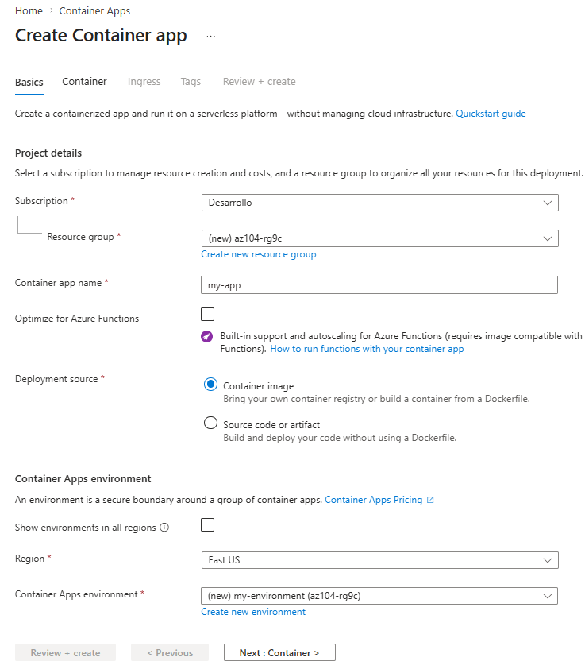
    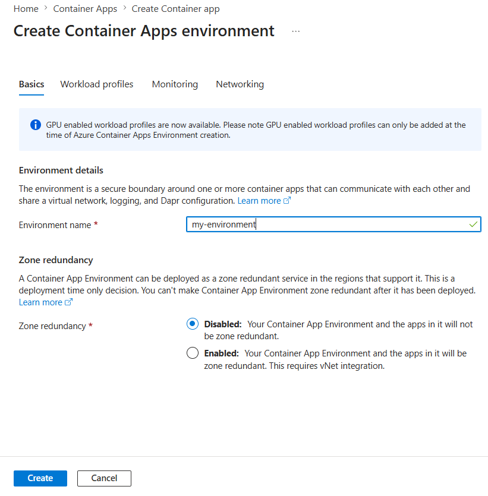

4. Avanzamos a la pestaña **Container** y verificamos que la opción **Use quickstart image** esté marcada. (Es posible que tengamos que desplazarnos hacia arriba para verla).
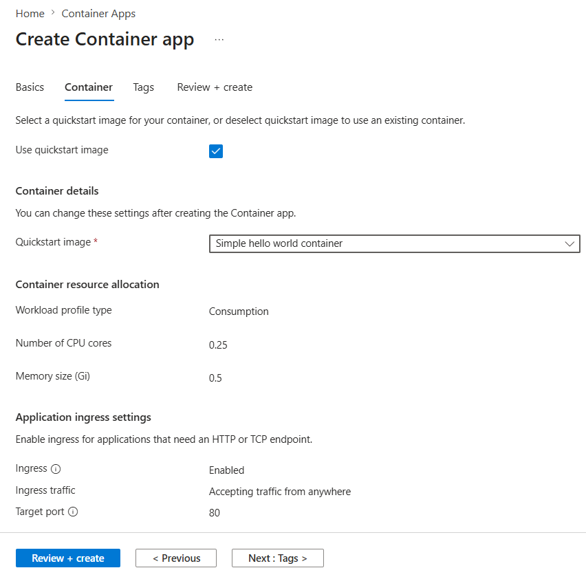

5. Confirmamos que la imagen de inicio rápido esté configurada como **Simple hello world container**. (Podemos observar que existen otras alternativas).
6. Seleccionamos **Review + Create** y luego **Create** para desplegar la aplicación.
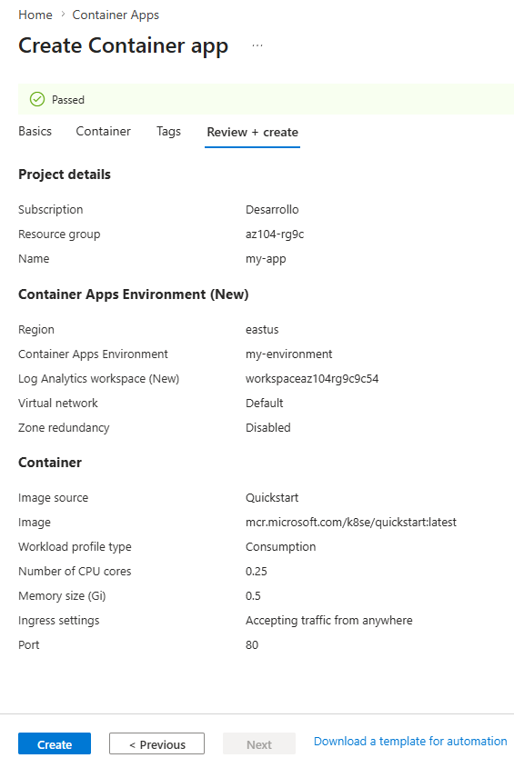

> **Nota:** debemos esperar unos minutos a que se complete el despliegue del contenedor. Este proceso suele tardar un par de minutos.
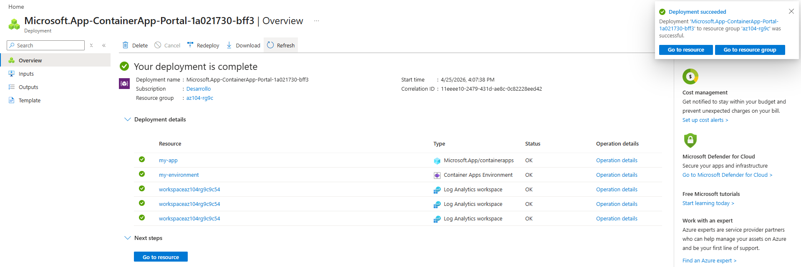

---

### Tarea 2: Test and verify deployment of the Azure Container App

Por defecto, la **Azure Container App** que hemos creado acepta tráfico en el **puerto 80** utilizando la aplicación de ejemplo *Hello World*. Al desplegarla, Azure nos asigna un **nombre DNS público** para acceder a la aplicación.  

1. Una vez finalizado el despliegue, seleccionamos **Go to resource** para visualizar nuestra nueva Container App.  
2. En la hoja de recursos, copiamos el enlace que aparece junto a **Application URL**.
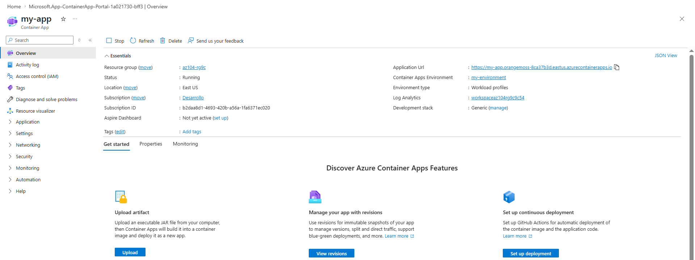

3. Pegamos y navegamos hacia esa URL en el navegador.  
4. Verificamos que se muestre el mensaje: **Your Azure Container Apps app is live**.
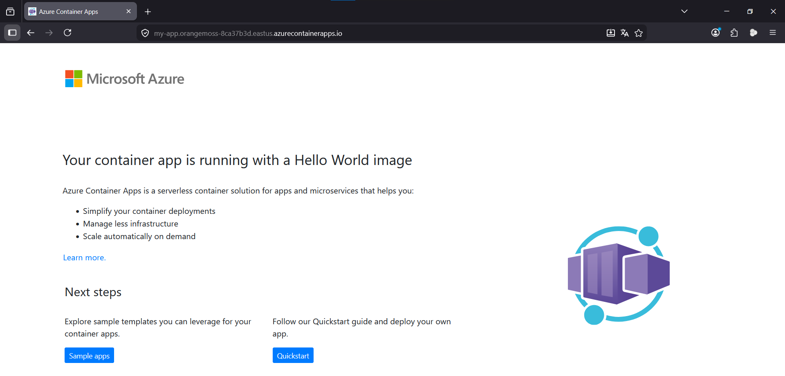

Con esta tarea confirmamos que la aplicación está disponible públicamente, que responde correctamente al tráfico HTTP y que el despliegue se ha realizado de manera exitosa en el entorno de Azure Container Apps.

---

## Conceptos reforzados

- Contenedores administrados sin necesidad de clúster propio.
- Escalado automático y simplificación de la administración.
- Migración de aplicaciones desde entornos locales hacia la nube.

---

## Resultados esperados

- Aplicación desplegada en ACA accesible vía DNS público.
- Validación exitosa del mensaje de disponibilidad.

---

## Limpieza de recursos

Si estamos trabajando con nuestra propia suscripción, es importante que dediquemos unos minutos a **eliminar los recursos del laboratorio**. De esta manera liberamos capacidad en Azure y evitamos costos innecesarios. La forma más sencilla de hacerlo es borrar directamente el *resource group* que contiene todos los elementos desplegados.

- **Desde el portal de Azure:**  

  1. Seleccionamos el *resource group* creado para el laboratorio.  
  2. Hacemos clic en **Delete resource group**.  
  3. Escribimos el nombre del grupo de recursos para confirmar.  
  4. Finalmente, seleccionamos **Delete**.
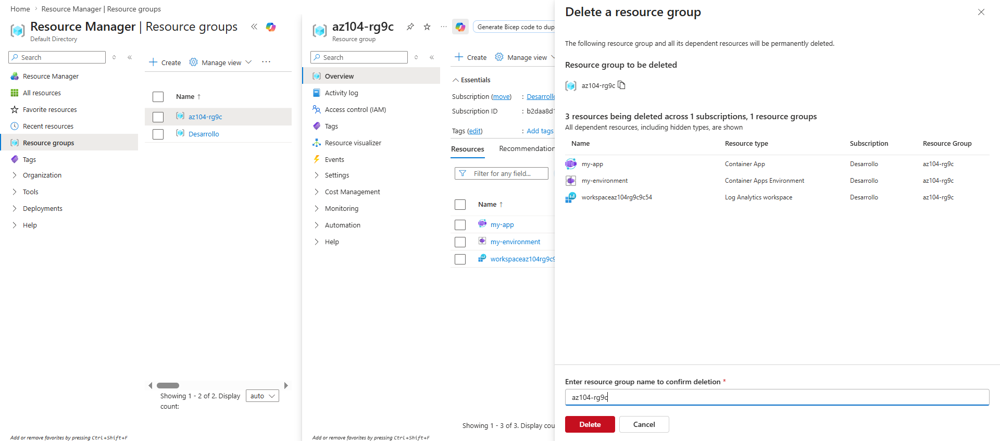

- **Usando Azure PowerShell:**

  ```powershell
  Remove-AzResourceGroup -Name az104-rg9
  ```

- **Usando la CLI de Azure:**  

  ```bash
  az group delete --name az104-rg9
  ```

Con este paso nos aseguramos de que todos los recursos asociados al laboratorio se eliminen correctamente, manteniendo nuestra suscripción ordenada y optimizando los costos.

---

## Contribuciones

Este README fue adaptado y contextualizado para el curso **AZ-104 Microsoft Azure Administrator**, integrando explicaciones ampliadas y costos actualizados.

---

## Licencia

Este documento se distribuye bajo la licencia MIT. Puedes reutilizarlo y adaptarlo libremente con atribución correspondiente.
